# 🧬 Computational Drug Discovery Suite

[](https://python.org)
[](https://pytorch.org)
[](https://rdkit.org)
[](https://pytorch-geometric.readthedocs.io)
[](LICENSE)

> **A comprehensive computational drug discovery platform combining pharmacophore-based virtual screening with Graph Attention Networks**

This repository showcases an end-to-end drug discovery pipeline that integrates:
- 🔬 **Multi-metric molecular similarity** (Morgan, 2D/3D Pharmacophore)
- 🧠 **Deep Learning** with Graph Attention Networks (GAT)
- ⚛️ **Quantum Chemistry** features from DFT calculations
- 📊 **Interactive dashboards** for real-time analysis

---

## 📑 Table of Contents

- [Overview](#-overview)
- [Key Features](#-key-features)
- [Pipeline Architecture](#-pipeline-architecture)
- [Drug Screening Pipeline](#-drug-screening-pipeline)
  - [Interactive Property Filter](#-interactive-property-filter)
  - [Drug Screener Dashboard](#-drug-screener-dashboard)
  - [Similarity Metrics](#-similarity-metrics-explained)
- [Graph Attention Network](#-graph-attention-network-for-binding-prediction)
  - [Architecture](#gat-architecture)
  - [Attention Mechanism](#understanding-attention-weights)
  - [DFT Feature Integration](#dft-feature-integration)
- [Interactive Dashboards](#-interactive-dashboards)
  - [DrugQuest Dashboard](#drugquest-dashboard)
  - [GAT-Specific Analysis Dashboard](#gat-specific-analysis-dashboard)
- [Installation](#-installation)
- [Usage](#-usage)
- [Results](#-results)
- [Project Structure](#-project-structure)

---

## 🎯 Overview

This project implements a **two-stage computational drug discovery workflow** targeting **COX-2 inhibitors** (anti-inflammatory drugs):

```
┌─────────────────────────────────────────────────────────────────────────────┐
│                         DRUG DISCOVERY PIPELINE                             │
├─────────────────────────────────────────────────────────────────────────────┤
│                                                                             │
│   STAGE 1: Virtual Screening Pipeline (drug_screening-5.ipynb)             │
│   ─────────────────────────────────────────────────────────────             │
│   • Drug-likeness filtering (Lipinski, Veber, Lead-like)                   │
│   • Multi-metric similarity (Morgan, Pharm2D, Pharm3D)                     │
│   • Consensus scoring and candidate ranking                                 │
│   • Interactive visualization and exploration                               │
│                                                                             │
│                              ↓                                              │
│                                                                             │
│   STAGE 2: Deep Learning Binding Prediction (gat_multitask_binding.ipynb)  │
│   ─────────────────────────────────────────────────────────────────────    │
│   • Graph Attention Network with DFT features                               │
│   • Multi-task learning for pharmacophore prediction                        │
│   • Attention-based interpretability                                        │
│   • COX-2 binding site pharmacophore scoring                               │
│                                                                             │
└─────────────────────────────────────────────────────────────────────────────┘
```

---

## ✨ Key Features

| Feature | Description |
|---------|-------------|
| **🔍 Multi-Metric Screening** | Combines Morgan fingerprints, 2D/3D pharmacophore similarity |
| **⚛️ DFT Integration** | Quantum chemical features (Fukui indices, ESP, charges) |
| **🧠 Graph Attention Networks** | State-of-the-art GNN with interpretable attention |
| **📊 Interactive Dashboards** | 4 comprehensive dashboards for analysis |
| **🎯 COX-2 Specific** | Pharmacophore requirements from PDB structure 4PH9 |
| **📈 Consensus Scoring** | Weighted multi-metric candidate ranking |

---

## 🏗️ Pipeline Architecture

### High-Level Overview

```
                    ┌──────────────────┐
                    │  SMILES Dataset  │
                    │   (185 drugs)    │
                    └────────┬─────────┘
                             │
              ┌──────────────┴──────────────┐
              ▼                              ▼
┌─────────────────────────┐    ┌─────────────────────────┐
│   SCREENING PIPELINE    │    │    GNN PIPELINE         │
├─────────────────────────┤    ├─────────────────────────┤
│ • RDKit Parsing         │    │ • Graph Construction    │
│ • Drug-likeness Filter  │    │ • Node Features (43d)   │
│ • Similarity Analysis   │    │ • Edge Features (5d)    │
│ • Consensus Scoring     │    │ • GAT Training          │
└───────────┬─────────────┘    └───────────┬─────────────┘
            │                              │
            ▼                              ▼
┌─────────────────────────┐    ┌─────────────────────────┐
│  Drug Screener Dashboard │    │   DrugQuest Dashboard   │
│  • Radar Comparison     │    │   • Binding Scores      │
│  • 3D Pharmacophore     │    │   • Atom Importance     │
│  • Shape Alignment      │    │   • Chemistry Analysis  │
└─────────────────────────┘    └─────────────────────────┘
```

---

## 🔬 Drug Screening Pipeline

The screening pipeline (`drug_screening-5.ipynb`) implements a comprehensive virtual screening workflow that filters and ranks drug candidates using multiple orthogonal metrics.

### 📊 Interactive Property Filter

The **Interactive Property Filter** is a powerful widget-based tool for real-time molecule filtering based on drug-likeness criteria.

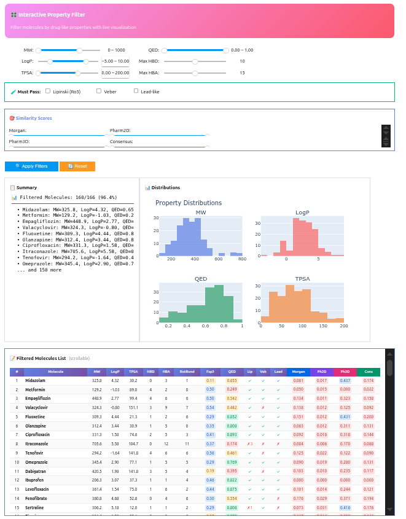

#### Filter Components

| Component | Description | Purpose |
|-----------|-------------|---------|
| **Property Sliders** | MW, LogP, TPSA, QED, HBD, HBA | Continuous property filtering |
| **Rule Checkboxes** | Lipinski, Veber, Lead-like | Binary rule compliance |
| **Similarity Scores** | Morgan, Pharm2D, Pharm3D, Consensus | Reference-based filtering |
| **Distribution Plots** | Real-time histograms | Visual feedback |
| **Molecule Table** | Sortable results | Detailed inspection |

#### Drug-Likeness Rules Implemented

```
┌────────────────────────────────────────────────────────────────────────────┐
│                      DRUG-LIKENESS FILTERING RULES                         │
├────────────────────────────────────────────────────────────────────────────┤
│                                                                            │
│  LIPINSKI'S RULE OF FIVE (1997)                                           │
│  ───────────────────────────────                                          │
│  Predicts oral bioavailability. Pass if ≥4 criteria met:                  │
│                                                                            │
│    ┌─────────────────┬────────────┬─────────────────────────────────────┐ │
│    │ Property        │ Threshold  │ Rationale                           │ │
│    ├─────────────────┼────────────┼─────────────────────────────────────┤ │
│    │ Molecular Weight│ ≤ 500 Da   │ Small enough for membrane passage   │ │
│    │ LogP            │ ≤ 5        │ Balanced lipophilicity              │ │
│    │ H-Bond Donors   │ ≤ 5        │ Limited desolvation penalty         │ │
│    │ H-Bond Acceptors│ ≤ 10       │ Limited desolvation penalty         │ │
│    └─────────────────┴────────────┴─────────────────────────────────────┘ │
│                                                                            │
│  VEBER'S RULES (2002)                                                     │
│  ────────────────────                                                     │
│  Predicts intestinal permeability:                                        │
│                                                                            │
│    • Rotatable Bonds ≤ 10  →  Molecular flexibility constraint            │
│    • TPSA ≤ 140 Ų         →  Polar surface area limit                    │
│                                                                            │
│  LEAD-LIKE CRITERIA (Teague, 1999)                                        │
│  ─────────────────────────────────                                        │
│  More stringent for early-stage optimization:                             │
│                                                                            │
│    • MW ≤ 450              →  Room for chemical optimization              │
│    • LogP ≤ 4.5            →  Lower lipophilicity                         │
│    • Rotatable Bonds ≤ 7   →  Reduced flexibility                         │
│                                                                            │
└────────────────────────────────────────────────────────────────────────────┘
```

#### QED Score (Quantitative Estimate of Drug-likeness)

The QED score (Bickerton et al., 2012) provides a single [0-1] score combining 8 properties:

$$QED = \exp\left(\frac{1}{n}\sum_{i=1}^{n} \ln d_i\right)$$

Where $d_i$ are desirability functions for MW, LogP, HBA, HBD, TPSA, RotBonds, Rings, and Alerts.

---

### 🎛️ Drug Screener Dashboard

The **Drug Screener Dashboard** is a comprehensive 8-tab interactive tool for exploring screening results with real-time molecular visualization.

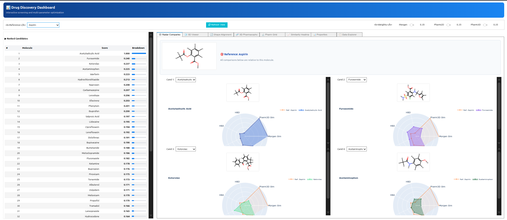

#### Dashboard Tabs

| Tab | Function | Key Features |
|-----|----------|--------------|
| **🕸️ Radar Comparison** | Multi-candidate property comparison | 4-way radar charts, similarity metrics |
| **🧊 3D Viewer** | Interactive molecular visualization | py3Dmol, multiple styles, rotation |
| **🔄 Shape Alignment** | 3D molecular overlay | RMSD calculation, shape similarity |
| **🧬 3D Pharmacophore** | Pharmacophore feature visualization | Color-coded spheres, feature comparison |
| **🔬 Pharm Grid** | Multi-molecule pharmacophore grid | Top N hits visualization |
| **📈 Similarity Heatmap** | Pairwise similarity matrix | Clustering patterns |
| **📊 Properties** | Detailed property analysis | Property distributions |
| **📋 Data Explorer** | Tabular data exploration | Sorting, filtering, export |

#### Feature Highlights

**Radar Comparison View**

- Compare up to 4 candidates against reference
- Visualize similarity across multiple metrics
- Identify pharmacophore matches

**3D Molecular Viewer**
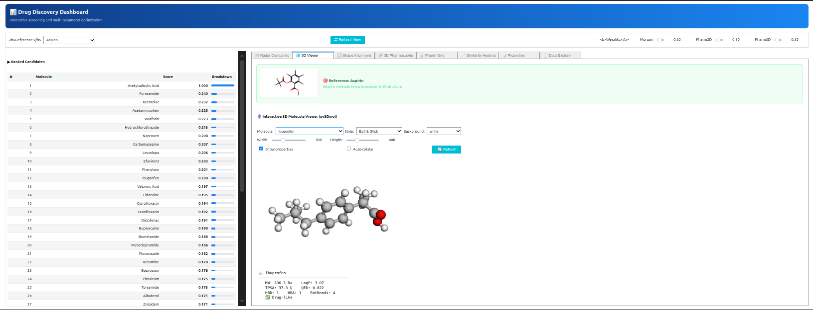
- Interactive py3Dmol visualization
- Multiple rendering styles (Ball & Stick, Stick, Sphere)
- Property overlay

**Shape Alignment**
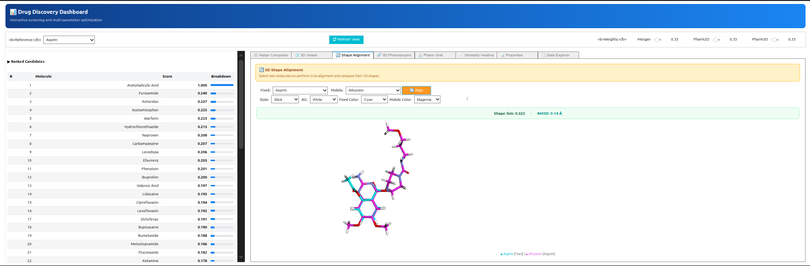
- O3A alignment algorithm
- RMSD and shape similarity metrics
- Color-coded reference vs candidate

**3D Pharmacophore Comparison**
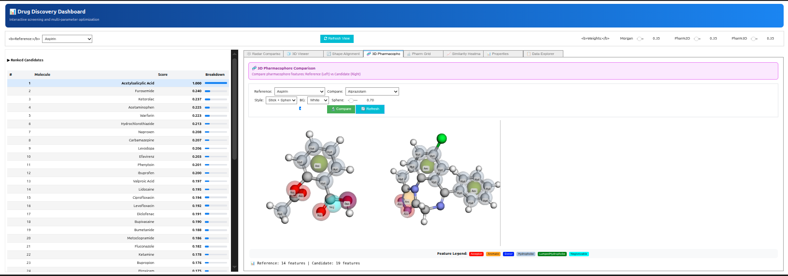
- Side-by-side pharmacophore visualization
- Feature-type color coding
- Feature count comparison

**Pharmacophore Grid View**
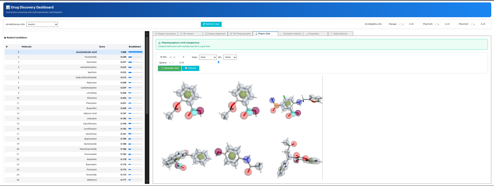
- Multiple candidates in grid layout
- Quick visual comparison
- Pharmacophore feature overlay

**Data Explorer**

- Complete scoring breakdown
- Top hits by each metric
- Exportable results

---

### 📐 Similarity Metrics Explained

The pipeline uses **three complementary similarity metrics** to capture different aspects of molecular similarity:

#### 1. Morgan/ECFP Fingerprints (2048-bit)

Extended Connectivity Fingerprints capture **circular substructures** around each atom:

```
        Radius 0          Radius 1          Radius 2 (ECFP4)
           C                C-C               C-C-C
           │                 │                  │
         (atom)         (+ neighbors)    (+ 2nd neighbors)
           ↓                 ↓                  ↓
        [hash₀]          [hash₁]           [hash₂]
                              
                    Final: 2048-bit vector
```

**Use Case**: Chemical series identification, finding close analogs

#### 2. 2D Pharmacophore Fingerprints (Gobbi-Pharm2D)

Encodes **pharmacophore feature pairs** with their **topological distances**:

```
    Feature A ──── n bonds ──── Feature B
        │                           │
    (Donor)                    (Acceptor)
        └─────────────┬─────────────┘
                      ↓
              Key: (D, A, n)
```

**Use Case**: Bioisostere discovery, scaffold hopping

#### 3. 3D Pharmacophore Fingerprints (Custom)

Encodes **spatial feature pairs** with **Euclidean distance bins**:

```
┌─────────────────────────────────────────────────────────────┐
│                3D PHARMACOPHORE PIPELINE                    │
├─────────────────────────────────────────────────────────────┤
│                                                             │
│  3D Molecule (DFT coords)                                   │
│         ↓                                                   │
│  Feature Detection (RDKit SMARTS)                          │
│         ↓                                                   │
│  ┌─────────────────────────────────────────────────────┐   │
│  │ Feature List:                                       │   │
│  │   • Donor    @ (1.2, 3.4, 5.6)                     │   │
│  │   • Acceptor @ (4.5, 2.1, 3.2)                     │   │
│  │   • Aromatic @ (2.0, 1.0, 4.0)                     │   │
│  └─────────────────────────────────────────────────────┘   │
│         ↓                                                   │
│  Pairwise Distance Calculation                             │
│         ↓                                                   │
│  Distance Binning:                                         │
│    Bin 0: 0-2Å   │ Bin 1: 2-4Å   │ Bin 2: 4-6Å           │
│    Bin 3: 6-8Å   │ Bin 4: 8-12Å  │ Bin 5: 12-20Å         │
│         ↓                                                   │
│  Fingerprint: {(Type1, Type2, Bin): Count}                 │
│                                                             │
└─────────────────────────────────────────────────────────────┘
```

**Use Case**: Binding mode prediction, 3D-QSAR

#### Tanimoto Similarity

All fingerprints use **Tanimoto coefficient** for comparison:

$$T(A, B) = \frac{|A \cap B|}{|A \cup B|} = \frac{c}{a + b - c}$$

#### Consensus Scoring

The final ranking uses **weighted consensus**:

$$\text{Consensus} = w_1 \cdot \text{Morgan} + w_2 \cdot \text{Pharm2D} + w_3 \cdot \text{Pharm3D}$$

| Strategy | Weights | Use Case |
|----------|---------|----------|
| **Balanced** | 0.33, 0.33, 0.34 | General screening |
| **Structural** | 0.6, 0.2, 0.2 | Close analog search |
| **Functional** | 0.2, 0.2, 0.6 | Scaffold hopping |

---

## 🧠 Graph Attention Network for Binding Prediction

The second pipeline (`gat_multitask_binding.ipynb`) uses **Graph Attention Networks** to predict binding compatibility with the COX-2 enzyme.

### GAT Architecture

```
┌─────────────────────────────────────────────────────────────────────────────┐
│                    MULTI-TASK GAT ARCHITECTURE                              │
├─────────────────────────────────────────────────────────────────────────────┤
│                                                                             │
│                        INPUT: Molecular Graph                               │
│                               ↓                                             │
│    ┌────────────────────────────────────────────────────────────────────┐  │
│    │                   NODE FEATURES (43 dimensions)                    │  │
│    │  ┌─────────────────────────┐    ┌─────────────────────────────┐   │  │
│    │  │    RDKit Features (33d) │    │    DFT Features (10d)       │   │  │
│    │  │  • Element one-hot (10) │    │  • Mulliken charges         │   │  │
│    │  │  • Degree one-hot (6)   │    │  • Löwdin charges           │   │  │
│    │  │  • Hybridization (5)    │    │  • Hirshfeld charges        │   │  │
│    │  │  • Valence (6)          │    │  • Fukui f+, f-, f0         │   │  │
│    │  │  • Aromaticity (1)      │    │  • Local electrophilicity   │   │  │
│    │  │  • Formal charge (1)    │    │  • Local nucleophilicity    │   │  │
│    │  │  • Num hydrogens (4)    │    │  • ESP at nuclei            │   │  │
│    │  └─────────────────────────┘    └─────────────────────────────┘   │  │
│    └────────────────────────────────────────────────────────────────────┘  │
│                               ↓                                             │
│    ┌────────────────────────────────────────────────────────────────────┐  │
│    │                   EDGE FEATURES (5 dimensions)                     │  │
│    │  • Bond type one-hot (4): Single, Double, Triple, Aromatic        │  │
│    │  • Mayer bond order (1): DFT-computed bond strength               │  │
│    └────────────────────────────────────────────────────────────────────┘  │
│                               ↓                                             │
│    ╔════════════════════════════════════════════════════════════════════╗  │
│    ║              GRAPH ATTENTION LAYER 1 (GATv2Conv)                   ║  │
│    ║         Input: 43d  →  Output: 256d (64 × 4 heads)                ║  │
│    ╚════════════════════════════════════════════════════════════════════╝  │
│                               ↓                                             │
│                    BatchNorm → ELU → Dropout(0.1)                          │
│                               ↓                                             │
│    ╔════════════════════════════════════════════════════════════════════╗  │
│    ║              GRAPH ATTENTION LAYER 2 (GATv2Conv)                   ║  │
│    ║         Input: 256d  →  Output: 64d (averaged heads)              ║  │
│    ╚════════════════════════════════════════════════════════════════════╝  │
│                               ↓                                             │
│                    BatchNorm → ELU                                         │
│                               ↓                                             │
│    ┌────────────────────────────────────────────────────────────────────┐  │
│    │                   GLOBAL MEAN POOLING                              │  │
│    │         Aggregate node embeddings → Graph embedding (64d)          │  │
│    └────────────────────────────────────────────────────────────────────┘  │
│                               ↓                                             │
│    ┌────────────────────────────────────────────────────────────────────┐  │
│    │                MULTI-TASK PREDICTION HEADS                         │  │
│    │  ┌─────┐ ┌─────┐ ┌─────┐ ┌──────┐ ┌──────┐ ┌──────┐              │  │
│    │  │ HBA │ │ HBD │ │LogP │ │ Arom │ │ TPSA │ │ Acid │              │  │
│    │  └──┬──┘ └──┬──┘ └──┬──┘ └──┬───┘ └──┬───┘ └──┬───┘              │  │
│    │     │       │       │       │        │        │                   │  │
│    │     └───────┴───────┴───────┴────────┴────────┘                   │  │
│    │                         ↓                                          │  │
│    │            Each: Linear(64→32) → ReLU → Linear(32→1)              │  │
│    └────────────────────────────────────────────────────────────────────┘  │
│                                                                             │
└─────────────────────────────────────────────────────────────────────────────┘
```

### Understanding Attention Weights

The **attention mechanism** is what makes GAT interpretable. It learns to assign different importance to different neighboring atoms.

#### Mathematical Formulation

For atom $i$ with neighbors $\mathcal{N}(i)$, the attention coefficient between atoms $i$ and $j$ is:

$$\alpha_{ij} = \frac{\exp(\text{LeakyReLU}(\mathbf{a}^T[\mathbf{W}\mathbf{h}_i \| \mathbf{W}\mathbf{h}_j \| \mathbf{e}_{ij}]))}{\sum_{k \in \mathcal{N}(i)} \exp(\text{LeakyReLU}(\mathbf{a}^T[\mathbf{W}\mathbf{h}_k \| \mathbf{W}\mathbf{h}_i \| \mathbf{e}_{ik}]))}$$

Where:
- $\mathbf{h}_i, \mathbf{h}_j$ = node feature vectors
- $\mathbf{e}_{ij}$ = edge features (bond order)
- $\mathbf{W}$ = learnable weight matrix
- $\mathbf{a}$ = attention weight vector

#### Atom Importance Calculation

```
┌─────────────────────────────────────────────────────────────────────────────┐
│                     ATTENTION → ATOM IMPORTANCE                             │
├─────────────────────────────────────────────────────────────────────────────┤
│                                                                             │
│   1. Forward pass with return_attention=True                               │
│                      ↓                                                      │
│   2. Get attention weights α_ij for all edges                              │
│                      ↓                                                      │
│   3. For each atom i, aggregate incoming attention:                        │
│                                                                             │
│      Importance(i) = Σ α_ji   (sum over all j pointing to i)              │
│                      j→i                                                    │
│                      ↓                                                      │
│   4. Normalize to [0, 1] range                                             │
│                      ↓                                                      │
│   5. Map to molecular visualization                                        │
│                                                                             │
│   Example Output:                                                           │
│   ┌─────────────────────────────────────────────────────────────────────┐  │
│   │  Atom 0 (C):  ████████░░  0.78  ← High importance (aromatic carbon) │  │
│   │  Atom 1 (C):  ██████░░░░  0.62                                      │  │
│   │  Atom 2 (N):  █████████░  0.91  ← Highest (H-bond acceptor)         │  │
│   │  Atom 3 (O):  ████████░░  0.85  ← High (carboxylic acid)            │  │
│   │  Atom 4 (C):  ████░░░░░░  0.41                                      │  │
│   └─────────────────────────────────────────────────────────────────────┘  │
│                                                                             │
└─────────────────────────────────────────────────────────────────────────────┘
```

### DFT Feature Integration

**Density Functional Theory (DFT)** calculations provide quantum mechanical properties at atomic resolution:

| DFT Feature | Chemical Meaning | Drug Discovery Value |
|-------------|------------------|----------------------|
| **Mulliken Charges** | Electron density distribution | Electrostatic interactions |
| **Fukui f+** | Susceptibility to nucleophilic attack | Metabolic liability |
| **Fukui f-** | Susceptibility to electrophilic attack | Reactive site ID |
| **Local Electrophilicity** | Electron-accepting tendency | Covalent inhibitor design |
| **ESP at Nuclei** | Electrostatic potential | H-bonding prediction |
| **Mayer Bond Order** | Quantum bond strength | Bond stability |

### COX-2 Binding Site Pharmacophore

The binding score is calculated based on **COX-2 structural requirements** (PDB: 4PH9):

```
┌─────────────────────────────────────────────────────────────────────────────┐
│                    COX-2 BINDING SITE PHARMACOPHORE                         │
├─────────────────────────────────────────────────────────────────────────────┤
│                                                                             │
│   ┌─────────────────────────────────────────────────────────────────────┐  │
│   │                     BINDING POCKET                                   │  │
│   │                                                                      │  │
│   │         Arg120 ─────┐                                               │  │
│   │         (salt bridge)│     ┌───── Tyr385                            │  │
│   │                      │     │      (π-stacking)                      │  │
│   │                      ▼     ▼                                        │  │
│   │                   ╔═══════════╗                                     │  │
│   │      Tyr355 ─────▶║  LIGAND   ║◀───── Trp387                       │  │
│   │      (H-bond)     ╚═══════════╝       (π-stacking)                  │  │
│   │                      ▲     ▲                                        │  │
│   │                      │     │                                        │  │
│   │         Ser530 ─────┘     └───── Hydrophobic                        │  │
│   │         (H-bond)                  Pocket                            │  │
│   │                                                                      │  │
│   └─────────────────────────────────────────────────────────────────────┘  │
│                                                                             │
│   PHARMACOPHORE REQUIREMENTS:                                               │
│   ┌─────────────────────┬─────────────────┬─────────────────────────────┐  │
│   │ Feature             │ Optimal Range   │ Biological Rationale        │  │
│   ├─────────────────────┼─────────────────┼─────────────────────────────┤  │
│   │ Acidic Group        │ Present         │ Salt bridge with Arg120     │  │
│   │ H-Bond Acceptors    │ 1-6             │ Tyr355, Ser530 interactions │  │
│   │ H-Bond Donors       │ 0-4             │ Hydrogen bond network       │  │
│   │ LogP                │ 1.0-5.5         │ Hydrophobic pocket fit      │  │
│   │ Aromatic Rings      │ 1-4             │ π-stacking with Tyr385      │  │
│   │ Molecular Weight    │ 150-600 Da      │ Binding pocket size         │  │
│   │ TPSA                │ 20-140 Ų       │ Membrane permeability       │  │
│   │ Rotatable Bonds     │ ≤ 10            │ Entropic penalty            │  │
│   └─────────────────────┴─────────────────┴─────────────────────────────┘  │
│                                                                             │
│   SCORING FORMULA:                                                          │
│                                                                             │
│   Score = Σ(wᵢ × sᵢ) / Σwᵢ                                                 │
│                                                                             │
│   Where sᵢ ∈ [0,1] is the criterion score and wᵢ is its weight            │
│                                                                             │
└─────────────────────────────────────────────────────────────────────────────┘
```

---

## 🎛️ Interactive Dashboards

### DrugQuest Dashboard

The **DrugQuest Dashboard** is a comprehensive 7-tab analysis suite for COX-2 binding prediction results.

#### Dashboard Tabs

**1. Rankings Tab**
- Molecule scoring with adjustable weights
- Visual score bars
- Quick molecule selection

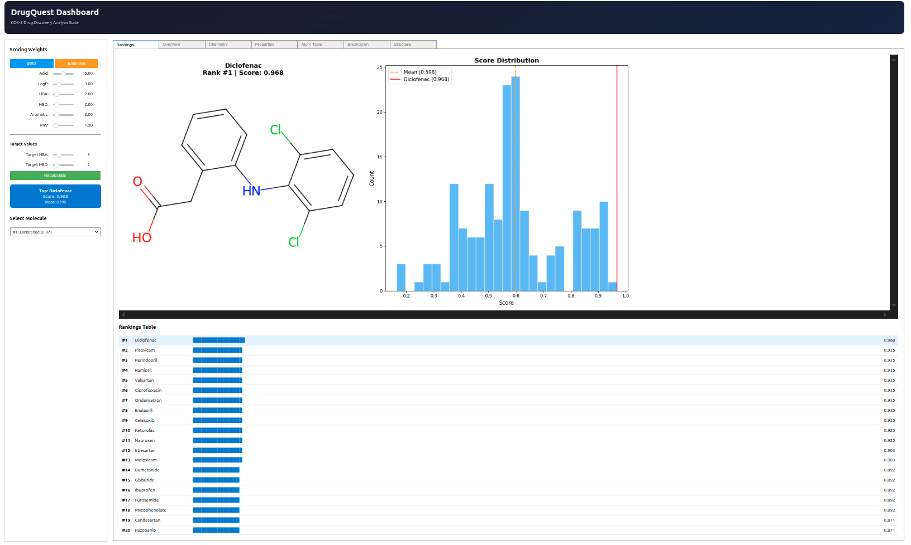

**2. Overview Tab**
- Molecular structure with highlighted atoms
- Atom importance bar chart
- Property radar comparison
- Importance category summary (High/Medium/Low)

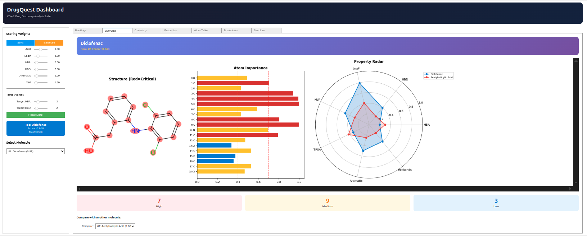

**3. Chemistry Tab**
- Fragment importance analysis
- Functional group detection
- COX-2 binding site context
- Fragment/functional group counts

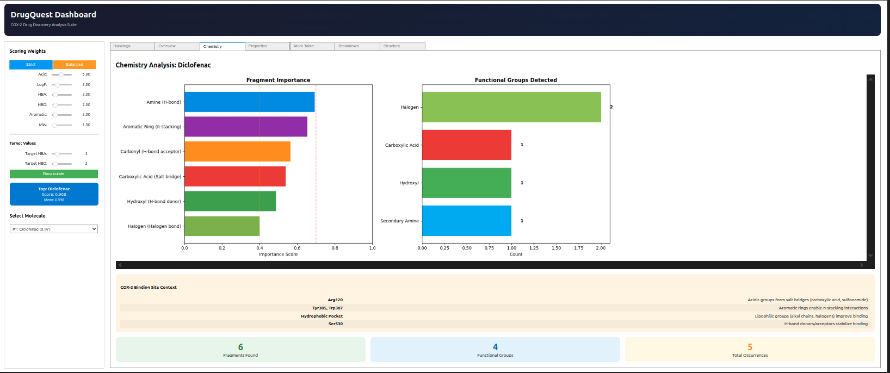

**4. Properties Tab**
- Detailed property analysis
- Target comparison charts
- Drug-likeness assessment

**5. Atom Table Tab**
- Per-atom importance scores
- Element-wise breakdown
- Sortable data table

**6. Breakdown Tab**
- Score component visualization
- Weight contribution pie chart
- Detailed pass/fail status

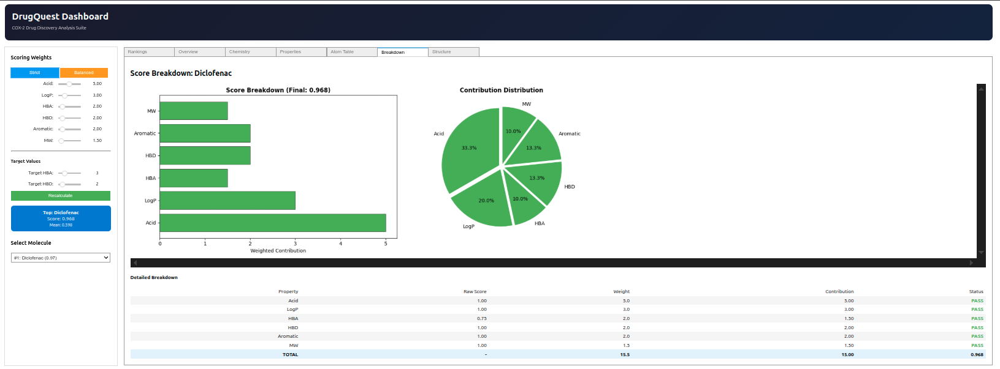

**7. Structure Tab**
- Scaffold analysis
- Scaffold frequency charts
- Scaffold performance comparison
- Molecular substructure images

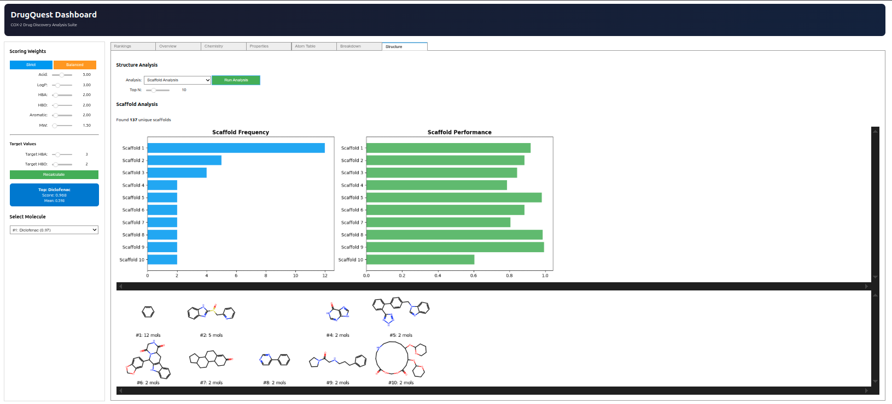

### GAT-Specific Analysis Dashboard

The **GAT-Specific Analysis Dashboard** provides deep insights into the Graph Attention Network's learning.

#### Dashboard Tabs

**1. Attention Flow Tab**
- Layer-wise attention visualization
- Multi-head attention comparison
- Edge thickness = attention weight

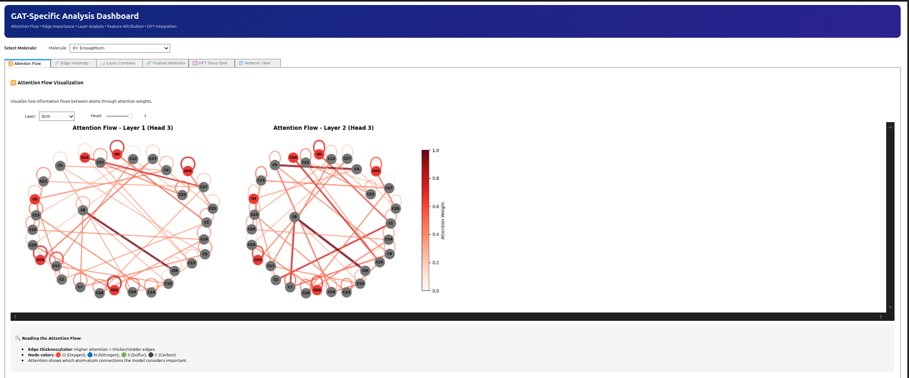

**2. Edge Heatmap Tab**
- Attention weight matrix
- Source-target atom relationships
- Clustering patterns

**3. Layer Compare Tab**
- Layer 1 vs Layer 2 attention
- Information flow analysis

**4. Feature Attribution Tab**
- DFT feature importance
- Per-feature contribution scores

**5. DFT Deep Dive Tab**
- Atomwise DFT feature visualization
- Charge distribution maps
- Fukui index analysis

**6. Network View Tab**
- Combined network visualization
- Node size = atom importance
- Edge width = Mayer bond order
- Edge color = combined importance

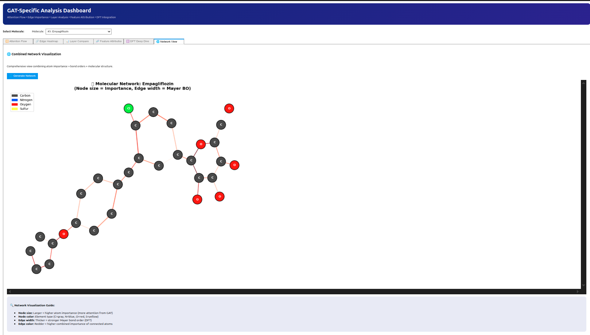

---

## 📦 Installation

### Prerequisites

- Python 3.9+
- CUDA (optional, for GPU acceleration)

### Quick Start

```bash
# Clone repository
git clone https://github.com/yourusername/drug-discovery-suite.git
cd drug-discovery-suite

# Create conda environment
conda create -n drugdiscovery python=3.9
conda activate drugdiscovery

# Install PyTorch (CPU)
pip install torch torchvision torchaudio

# Or for CUDA 11.8
pip install torch torchvision torchaudio --index-url https://download.pytorch.org/whl/cu118

# Install PyTorch Geometric
pip install torch_geometric

# Install other dependencies
pip install rdkit pandas numpy matplotlib seaborn py3Dmol ipywidgets plotly scikit-learn

# Install Jupyter
pip install jupyter jupyterlab
```

### Verify Installation

```python
import torch
import torch_geometric
from rdkit import Chem
import py3Dmol

print(f"PyTorch: {torch.__version__}")
print(f"PyG: {torch_geometric.__version__}")
print(f"CUDA: {torch.cuda.is_available()}")
```

---

## 🚀 Usage

### Running the Screening Pipeline

```bash
jupyter notebook drug_screening-5.ipynb
```

1. Run all cells sequentially
2. Use the Interactive Property Filter to set thresholds
3. Click "Apply Filters" to filter molecules
4. Explore results in the Drug Screener Dashboard

### Running the GAT Pipeline

```bash
jupyter notebook gat_multitask_binding.ipynb
```

1. Run all cells to train the model
2. Explore attention patterns in the GAT Dashboard
3. Analyze binding scores in the DrugQuest Dashboard

---

## 📈 Results

### Screening Pipeline Performance

| Metric | Value |
|--------|-------|
| Initial Dataset | 185 molecules |
| Lipinski Compliant | 166 (89.7%) |
| Lead-like | 98 (53.0%) |
| Top Consensus Hits | See notebook |

### GAT Model Performance

| Metric | Value |
|--------|-------|
| Training Molecules | 148 |
| Validation Molecules | 37 |
| Best Val Loss | ~0.15 |
| Tasks | 6 (HBA, HBD, LogP, Aromatic, TPSA, Acid) |

### Top COX-2 Candidates

| Rank | Molecule | Binding Score |
|------|----------|---------------|
| 1 | Diclofenac | 0.968 |
| 2 | Piroxicam | 0.945 |
| 3 | Perindopril | 0.943 |
| 4 | Ramipril | 0.933 |
| 5 | Valsartan | 0.933 |

---


## 🤝 Contributing

Contributions are welcome! Please feel free to submit a Pull Request.

1. Fork the repository
2. Create your feature branch (`git checkout -b feature/AmazingFeature`)
3. Commit your changes (`git commit -m 'Add some AmazingFeature'`)
4. Push to the branch (`git push origin feature/AmazingFeature`)
5. Open a Pull Request

---

## 📜 License

This project is licensed under the MIT License - see the [LICENSE](LICENSE) file for details.

---

## 📚 References

1. Lipinski, C.A. et al. (1997). Experimental and computational approaches to estimate solubility and permeability in drug discovery and development settings. *Adv. Drug Deliv. Rev.*
2. Veličković, P. et al. (2018). Graph Attention Networks. *ICLR 2018*
3. Brody, S. et al. (2022). How Attentive are Graph Attention Networks? *ICLR 2022*
4. Bickerton, G.R. et al. (2012). Quantifying the chemical beauty of drugs. *Nat. Chem.*

---

## 📧 Contact

**Author**: Mayukh Sarkar

---

<p align="center">
  <i>Built with ❤️ for computational drug discovery</i>
</p>
